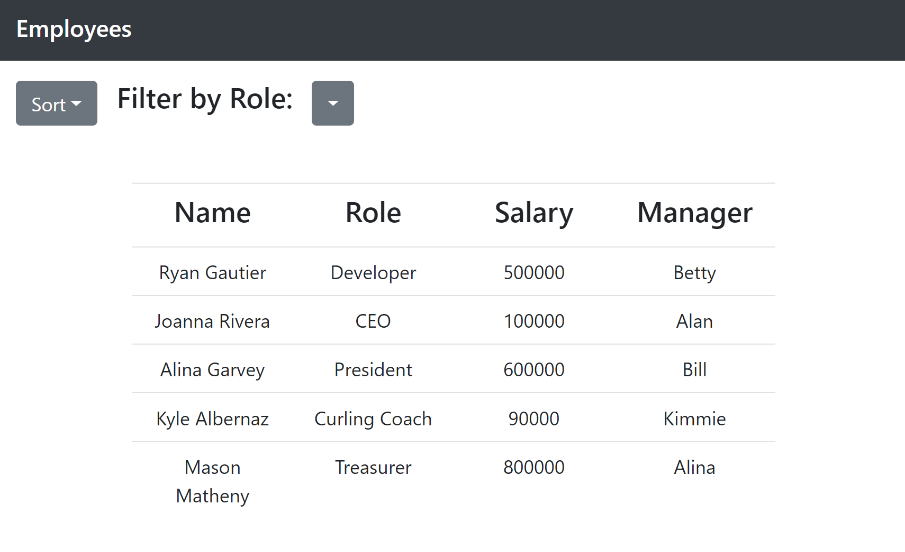

# Employee Directory

This application was bootstrapped with [Create React App](https://github.com/facebook/create-react-app).

The user is presented with a table of information about various hypothetical employees. The user may sort the table by any column value, or filter by role. 

## User Story

* As a user, I want to be able to view my entire employee directory at once so that I have quick access to their information.

## Acceptance Criteria

Given a table of random users, when the user loads the page, a table of employees should render. 

The user should be able to:

  * Sort the table by at least one category

  * Filter the users by at least one property.

## Screenshot of Application
